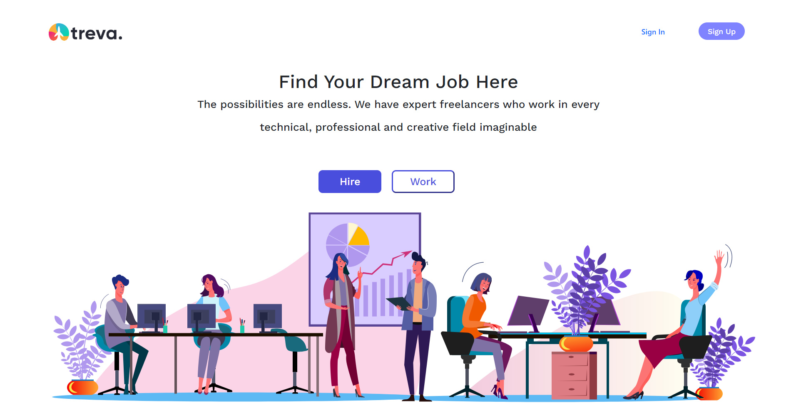

<h1 align="center">
  Treva
   
</h1>

<h3 align="center">
Treva is a marketplace for freelancers in fields like writing, graphic design and web development. The site helps professionals find projects, communicate with clients and get paid. If you're a new freelancer, or working in a new field, you can rack up valuable experience without always having to pitch clients cold.
</h3>
 

<h4 align="center">
Home Page
</h4>

 

# Technical Details
This application is web-based, For all the front-end components, [ReactJs](https://reactjs.org/) is used and the player is completely HTML5-based. The application is essentially split into Grails for a REST-API, and ReactJs for the frontend.

Treva uses the [MongooDb](https://www.mongodb.com/) for the database.

# Roadmap
Treva is still very much a work-in-progress. We will be adding new features and bug-fixes often, but this is a hobby project for the core-contributors, so the time that we can spend on it is limited.

For all our feature and bug tracking, we use the [Issues Section](https://github.com/AzouKr/Freelance-Website/issues). Treva's 'roadmap' is currently to work through the feature requests and improvements that are in the issue tracker.  Take a look at the milestones for what we intend to add for upcoming releases.

# Some Images

  

  

  

 
